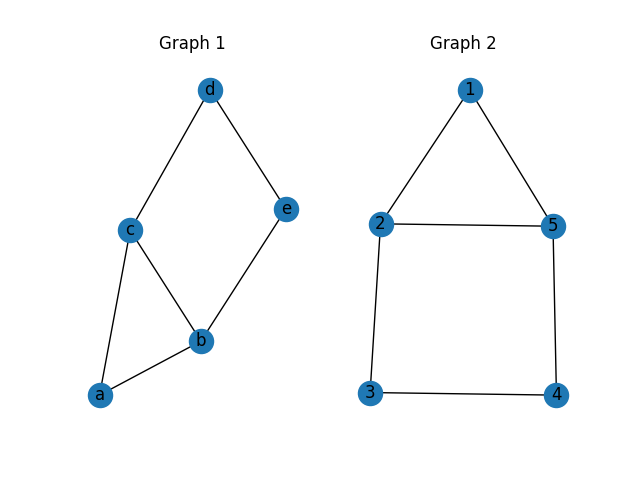
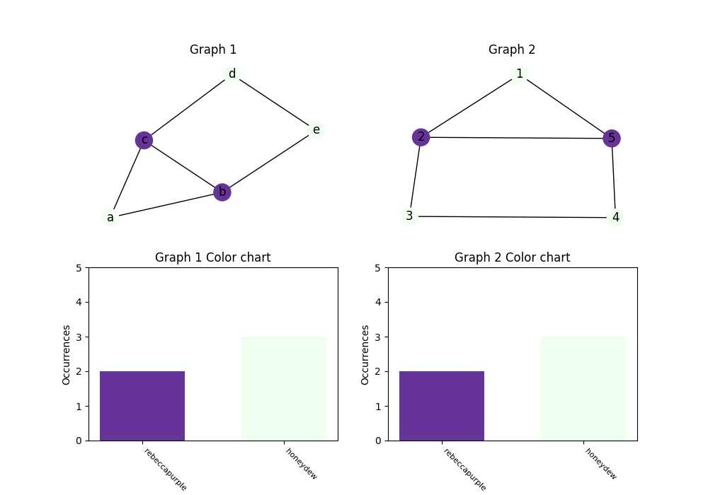
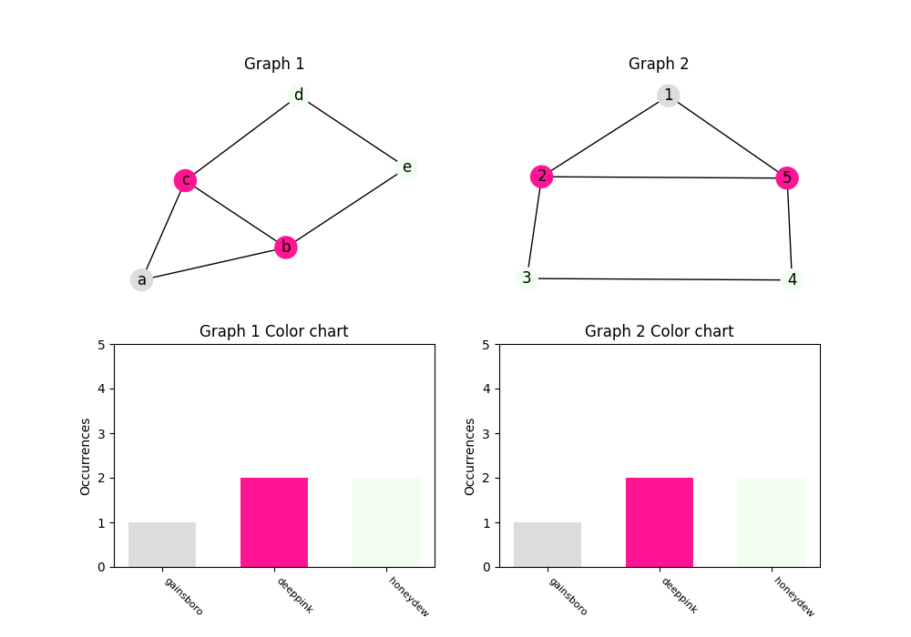
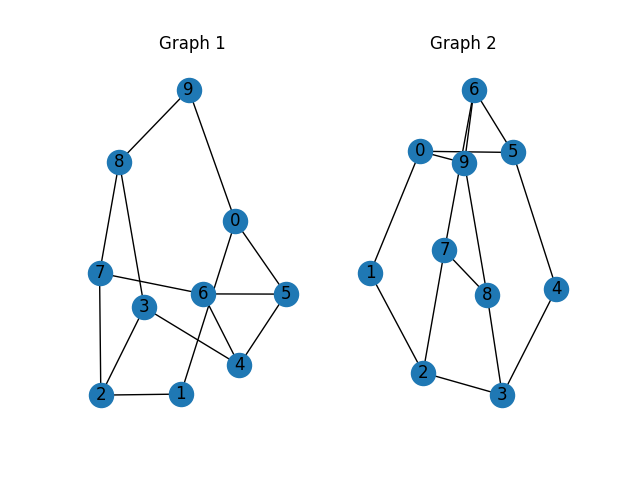
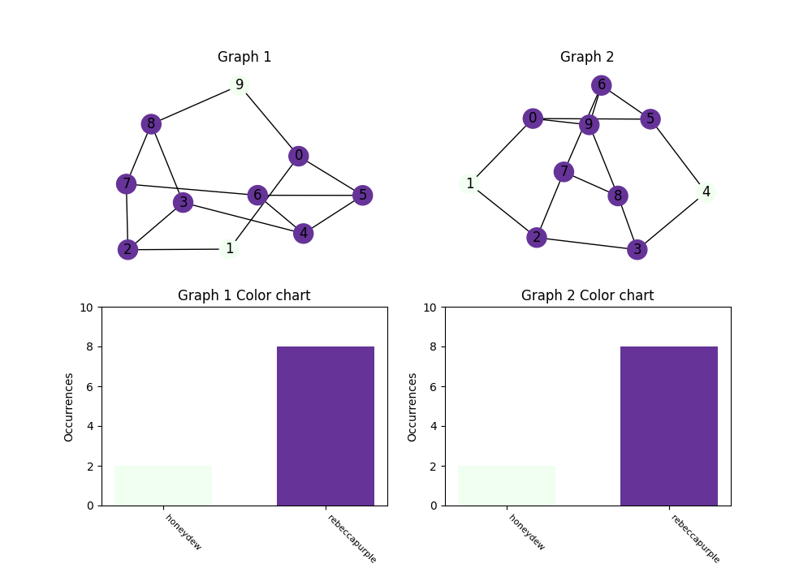
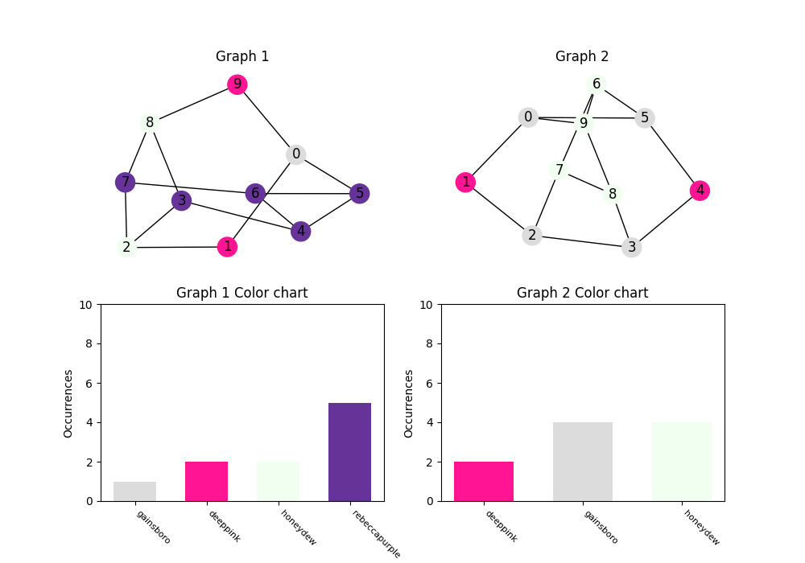
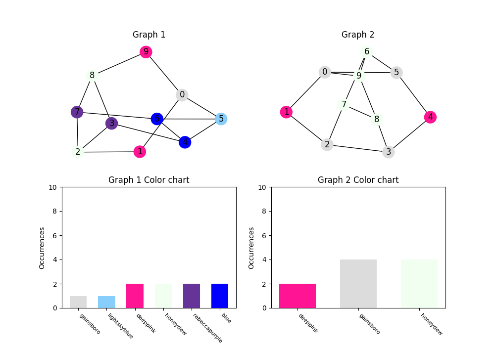

# Isomorphism Algorithms

This project contains implementations of three different algorithms for graph isomorphism checking. The algorithms included are:

1. [**Color Refinement (Weisfeiler-Lehman Test, 1-WL)**](#color-refinement-weisfeiler-lehman-test-1-wl)
2. [**Adjacency Matrix Comparison**](#adjacency-matrix-comparison)
3. [**VF2 Algorithm**](#vf2)

Each algorithm is implemented in its own separate package, and the main test script is located in `main.py`.

## Project Structure

- `color_refinement/` - Contains the implementation for the Color Refinement algorithm.
- `adjacency_matrix_comparison/` - Contains the implementation for Adjacency Matrix Comparison.
- `vf2/` - Contains the implementation for the VF2 algorithm.
- `test_graphs/` - Contains test graphs and neccessery functions for creating and visualizing them
- `main.py` - The main script that runs the tests for all three algorithms.
- `visualized_test/` - Contains pictures from tests (if any could be made).

## Contributors
Each algorithm is implemented by a different contributor, with each contributing one algorithm. The main test script is located in main.py.

Боян Зарев, факултетен номер: 123222004 -`color_refinement/`

Светлин Иванов, факултетен номер: 121222088 - `adjacency_matrix_comparison/`

Ивайло Николов, факултетен номер: 121222009 - `vf_2/`

## How to Run

1. Clone the repository to your local machine:
   ```bash
   git clone https://github.com/boce1/isomorphism_DS_project.git
   ```

2. Install the necessary dependencies (NOTE: python3.x must be added to the PATH variable):
   ```bash
   pip install networkx[default]
   pip install matplotlib
   ```

3. Run the main test script:
   ```bash
   python main.py
   ```

This will execute the tests for all three algorithms and print the results.

# Color Refinement (Weisfeiler-Lehman Test, 1-WL)
Тестът на Weisfeiler-Lehman поддържа състояние (или цвят) за всеки връх. Той предефинира състоянията на възлите като събира и обобщава информацията на техните им съседи. За да изчисли и предефинира новото състояние на върх, WL използва инективна хеш функция дефинирана в различни обекти по модул на класовете на еквивалентност. Това означава, че обектите се групират в класове на еквивалентност и хеш функцията отчита тази класификация. Ако два обекта принадлежат към един и същи клас на еквивалентност, те ще получат един и същи хеш.

## Fucntions
   ```python
   refine_labels(graph, node_labels)
   ```
   Args:
   - graph: (networkX graph) Graph wich labels will be renewed
   - node_labels: (dict {node_name: int}) classes from previous iteration from "hash function", if there is no prev iteration, the initial labels are node degrees

   Returns: new_labels


   ```python
   wl_test(G1, G2, max_iterations=10, visualize=False, node_size=default_node_size)
   ```
   Args:
   - G1: (networkX graph) First graph
   - G2: (networkX graph) Second graph
   - max_iterations: (int) Maximum iteration that 1-WL will go through
   - Visualize: (boolean) If True each step will be visualized (after each step user must close the window to continue)
   - node_size: (int) Size of nodes in the graph

   Returns: boolean (Are graphs isomorphic)


   ```python
   draw_color_2_graph(graph1, graph1_labels, graph2, graph2_labels, node_size=default_node_size)
   ```
   Args:
   - G1: (networkX graph) First graph
   - graph1_labels: (dict {node_name: int}) classes for nodes in G1
   - G2: (networkX graph) Second graph
   - graph2_labels: (dict {node_name: int}) classes for nodes in G2
   - node_size: (int) Node size

   Returns: None (Gives 2 graphs and their color chart for nodes classes)

## Test examples
### Test 1:


Phase 1:


Phase 2:


### Test 6:


Phase 1:


Phase 2:


Phase 3:



# VF2
VF2 е алгоритъм, който определя изоморфизма на два графа като използва техника “разделяй и владей”. При тази техника един проблем се разделя на по-малки такива, което позволява по-ефективното им решение. Целта на VF2 е да състави изображение m: V1 V2 , което е биекция. Най-напред се проверява дали броя върхове |V1| съвпада с броя върхове |V2|. След това се започва с изображение m, което е празно множество. Следващата стъпка е да се генерира декартово произведение от съпоставки (a, b), a element V1, b element V2, които са “кандидати” за добавяне. Всеки един кандидат се проверява дали отговаря на дадени условия и ако отговаря се изпълнява рекурсивно целия алгоритъм като се започва с изображение, към което е добавен конкретния кандидат. Когато броя съпоставки в m стане равен на броя върхове във V1, (|V1|=|V2|), тогава двете графи са изоморфни. Ако след всички обхождания и рекурсии броя съпоставки в m не достигне |V1|, то графите не са изоморфни.

## Fucntions

   ```python
   vf2_isomorphism(graph1, graph2)
   ```
   Args:
   - graph1: networkX graph
   - graph2: networkX graph

   Returns: bollean (are the graphs isomprphic)


   ```python
   is_feasible(mapping, u, v)
   ```
   Args:
   - mapping: list[(a, b)]
   - u: node from graph
   - v: node from graph 

   Returns: boolean (if node u and v can be mapped)

 
   ```python
   match(mapping)
   ```
   Args:
   - mapping: list[(a, b)]

   Returns: bollean (does mapping correspond to connections of graph 1 and 2)

# Adjacency Matrix Comparison

Алгоритъмът за сравнение на графи чрез матрици на съседство проверява изоморфизъм между два графа, като ги представя във вид на матрици и анализира тяхната структура. Това включва проверка на степени на върховете, сума на ребрата и спектрални характеристики (собствени стойности на матриците).
Методът е интуитивен и подходящ за бърза предварителна проверка, но не гарантира коректно разпознаване на изоморфизъм във всички случаи. Затова често се използва като част от комбиниран подход, заедно с по-мощни алгоритми като VF2 или Weisfeiler-Lehman (WL) тестване.

## Functions

   ```python
   convert_graph_to_adj_matrix(g1, g2):
   ```

   Check if two graphs are isomorphic by comparing adjacency matrices

   **Arguments:**
   - `g1`: networkX graph
   - `g2`: networkX graph

   **Return:** `bool` - `True` if the graphs can be isomorphic, otherwise `False`

   ```python
   basic_checks_pass(adj1, adj2):
   ```

   **Arguments:**
   - `adj1`: adjacency matrix of the first graph
   - `adj2`: adjacency matrix of the second graph

   **Return:** `bool` - `True` if the columns pass all basic checks

   ```python
   convert_graph_to_adj_matrix(graph):
   ```

   **Arguments:**
   - `graph`: `networkx.Graph` – conversion graph

   **Return:** `List[List[int]]` – adjacency matrix representing the graph

# PDF project

